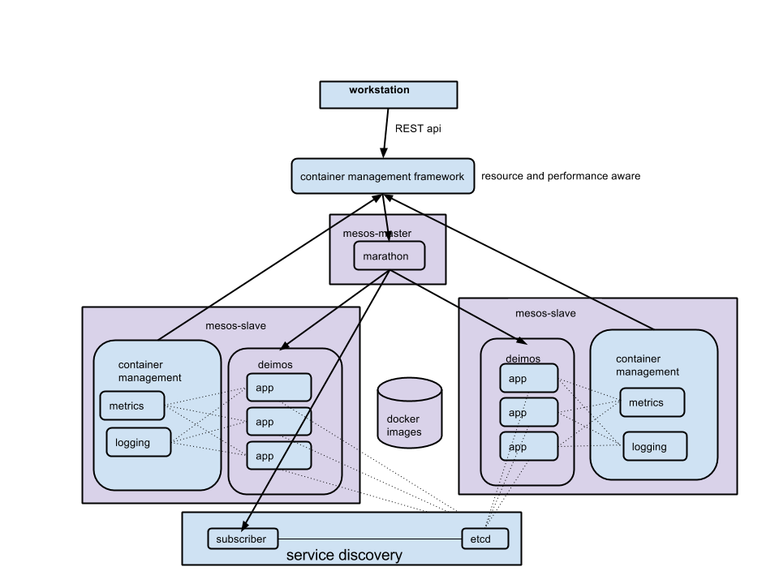

Mesos-Docker-Orchestrator
=========================

_this tool is composed of many separate components which are added into this repo as submodules_

This is a __cluster management__ tool using mesos and docker, it enables users to run their containers on a cluster 
without having to manually manage the cluster nodes themselves.

__directory overview__
* cluster
  * quick start scripts for setting up a mesos cluster
* comparisons
  * some research notes of different container management/orchestration technologies 
* launcher - useless stuff
* tools
  * mesos base image
  * example image 
  * dadvisor - host-level container monitoring example
  * subscriber (the subscriber to marathon that updates etcd config)


# Table of contents

- [Overview](#mesos-docker-orchestrator)
- [Table of contents](#table-of-contents)
- [Getting started](#getting-started)
	- [Setting up a mesos cluster](#setting-up-a-mesos-cluster)
	- [Setting up etcd service discovery](#setting-up-etcd-service-discovery)
	- [Launching images](#launching-images)
	- [Image Modifications](#image-modifications-for-service-discovery)
	- [Guestutils](#guestutils)
	- [Receiving Updates](#receiving-updates)
	- [Known Bugs](#known-bugs)
- [Architecture](#architecture)
- [Wishlist/Backlog](#wishlistbacklog)
- [Contact](#contact)


# Getting started


### Setting up a mesos cluster
* fabric files included for getting up and running with a mesos cluster
* what it will do:
 * setup and start mesos master with marathon
 * run etcd and subscriber on master node for service discovery
 * setup and start slave nodes with modified deimos 
* how to do it:
 * cd into cluster directory
 * place amazon key, secret, path to keypair, and master public ip in config.yaml
 * launch ec2 instances. name master node "mesos-master" and slave nodes "mesos-slave"
 * run the command `fab master_env master_main` to install and run mesos, marathon, etcd, subscriber on master
 * `fab slave_env slave_main` to install and run mesos, deimos on slaves
 * run `python setup_theseus.py` to setup theseus on your workstation
* __test it!__
  * `curl -X POST -H "Content-Type: application/json" localhost:5000/deploy -d@test.json`
* dependencies
 * fabric
 * fabric-ec2

__cooler docker method__
* be a hip cool g-dawg homie man
* create slave nodes with name `slave-node` and master node with name `master-node`
* update config file with your information
* place config.yaml (like example) and keypair in some directory.
* `docker run -v {{config_directory}}:/opt/cluster 54.189.193.228:5000/fabric fab master_env` master_main
  * sets up master node
* `docker run -v {{config_directory}}:/opt/cluster 54.189.193.228:5000/fabric fab slave_env slave_main`
  * sets up slave nodes


### Setting up etcd service discovery
Service discovery is implemented with __etcd__ and uses an event __subscriber__ to marathon to maintain status of containers. 
Before launching containers, you must set up an etcd host and a subscriber to marathon so that containers will be registered when mesos starts them.
The subscriber is a lightweight flask app that recieves callbacks from marathon and updates configuration information in etcd.
* __you do not need to do these setups if you used provided fabric files to setup cluster__
* build and push etcd and subscriber images (can be found in docker-images directory)
* run etcd
  * must map a host port to containers exposed port 4001 
  * ex: `docker run -p 4001:4001 54.189.193.228:5000/etcd`
* run subscriber
  * expects environment variables for `CONTAINER_HOST_ADDRESS` and `CONTAINER_HOST_PORT`. These are the public ips of the host and the port that is mapped to container port 5000
  * also expects `ETCD_HOST` and `MARATHON_HOST`
  * see README for marathon-subscriber for details

### Launching images
Interface to mesos cluster is Theseus, a framework build on top of marathon
* see <a href = 'https://git.autodesk.com/t-liuda/Theseus'>theseus readme</a> for more information
* namespacing: organizes deployments by service and labels
* manages apps and tasks in marathon and their configuration

as a developer, you only need to provide declarative specification on how you would like your image launched. here is an example. 
for more details see <a href='https://git.autodesk.com/t-liuda/Theseus'>this link</a>

```yaml
deploy:
  ingestor:
    image: 54.189.193.228:5000/flask
    ports: 
      ssh: 22
      api: 5000
    environment:
      APP_NAME: Ingestor
      KEYSPACE_NAME: 'flask_keyspace2'
      TABLE_NAME: 'flask_table2'
    instances: 4
    cpus: 0.1 
    mem: 128
    labels: ['dev']
```

### Image Modifications for Service Discovery
__quick start:__ images can be made to be extend mesos-base rather than ubuntu. In images, also include directory guestutils, which should contain `guestutils.py`,  `watcher.py`, `watch_methods.py`, and `etcd_driver.py`. to use guestutils simply import from the guestutils file (similar to importing from maestro guestutils). to use watch_methods, you must run `watcher.py` and set environment variable `WATCHES` to a comma-separated list of the services your image needs to watch. 

__example:__ see `example_mesos_image` in the `tools` directory

### Guestutils

To be registered properly in etcd images __must expose ports__ they need to map to host ports (explicit `EXPOSE port1 port2`... in Dockerfile)
Images should also __include python-etcd__. An example of this is in docker-images/etcd-base

Images can use the same convenience functions (same method names and signatures) implemented in maestro's guestutils by importing from guestutils.py inside a startup python script
* `get_environment_name`
* `get_service_name`
* `get_container_name`
* `get_container_host_address`
* `get_container_internal_address`
* `get_port(name, default)`
 * returns exposed internal port number of named port
* `get_node_list(service, ports = [ port1, port2 ])`
 * input: service name and optional list of port names
 * output: list of 'host_ip:port1:port2' ... where host_ip is instance host ip and ports are external ports
* `get_specific_port(service, container, port, default)`
 * inputs: service, container_name (task_id passed in by marathon), port name
 * optional default value
 * output: exposed port
* `get_specific_exposed_port(service, container, port, default)`
 * returns exposed port

### Receiving Updates
containers can be set up to recieve updates when certain services are modified. This is implemented through watching keys in etcd. you can set
which keys to watch with environment variables.
for more detailed examples of how to use guestutils and watcher, see example_mesos_image
* how to recieve updates:
 * include watcher.py and watch_methods.py (just like guestutils)
 * set `WATCHES=service1,service2,service3` environment variable (comma separated list of services to watch)
 * watcher.py will watch those keys in etcd and run the custom method in watch_methods.py
 * implement watch_methods.py to respond appropriately to changes recieved from etcd

here is an example of how you can implement the pluggable method `service_change(service, delta)`

```python
def service_change(service, delta):
	print 'service has changed: '+str(service)
	print '\t'+'delta is '+str(delta)
```

### Known Bugs

:_( unfortunately some bugs do exist
* sometimes subscriber becomes out of sync
 * here is what to do when that happens:
 * sent request to {{subscriber_host}}:{{subscriber_port}}/cleanup
 * subscriber will re-sync
 

# Architecture


## see <a href='DESIGN.md'>DESIGN.md</a> for specifics on how the system is architected
the components that make up this system are: `mesos-master` (`marathon`, `mesos`), `mesos-slave` (`deimos`, `mesos`), `subscriber`, `etcd`, and `theseus`.
to see the details of how these interact with each other, see <a href='DESIGN.md'>the design document</a>.

# Wishlist/Backlog

here are some features that would improve this system

### features
* flesh out REST interface
* finer control over containers 
 * __placement constraints__
 * restart containers on same slave
 * in event of hardware failure, checkpoint task -> restart this task
 * actual docker links
 * pods
 * __how to implement this:__ requires further modification of executor. some changes in theseus as well (adding custom  constraints)
* monitoring/convenience tasks running on slave host
 * log rolling
 * performance metrics
* complex signals between containers?
 * ex: before a cassandra node goes down it needs to tell other nodes so they can replicate data 
 * ex: graceful shutdown container
 * rethink etcd directory structure?
 * executor changes?
 * some theseus modifications idk
* smarter-scheduling
 * is __scheduling policy__ the responsibility of another layer?
* aggregate information from all layers into one place
 * one place to view whats running, whats where, slaves, logs, metrics, status, signals, etc

### operational
* security
* logs (not for containers but for system itself)

### refactoring
* watching keys - subprocess stuff is inefficient

# Contact

please reach me at davidbliu@gmail.com for more information
