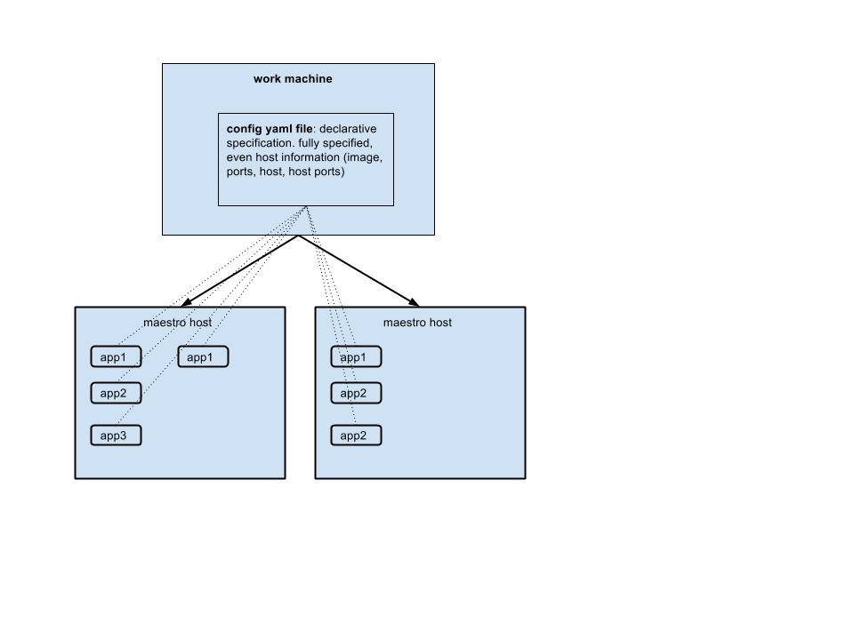
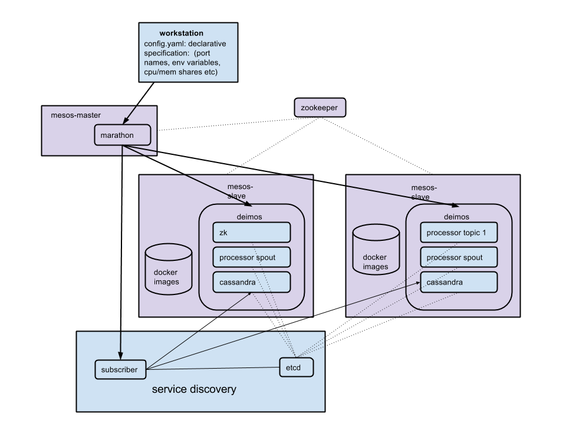
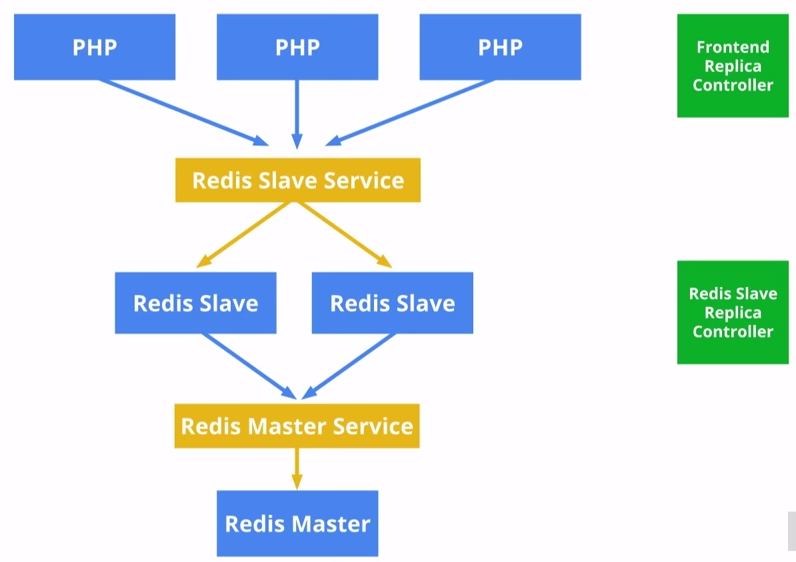
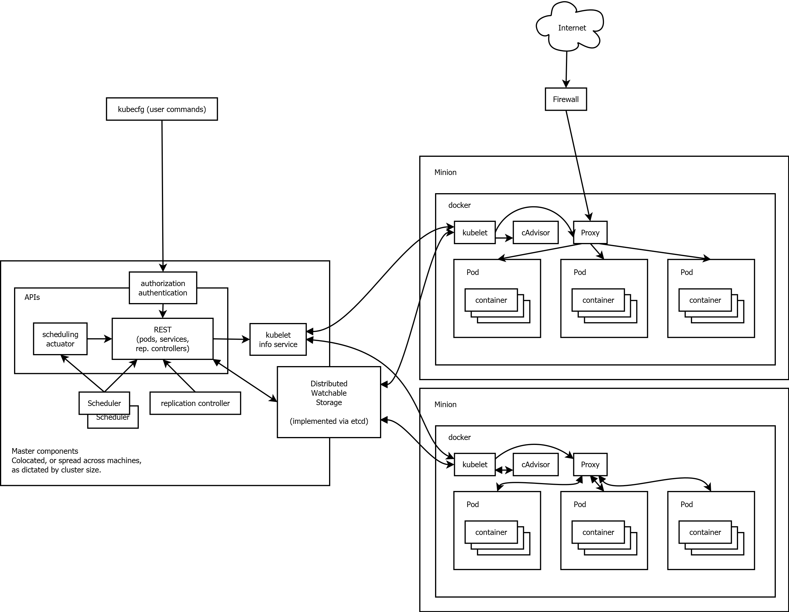
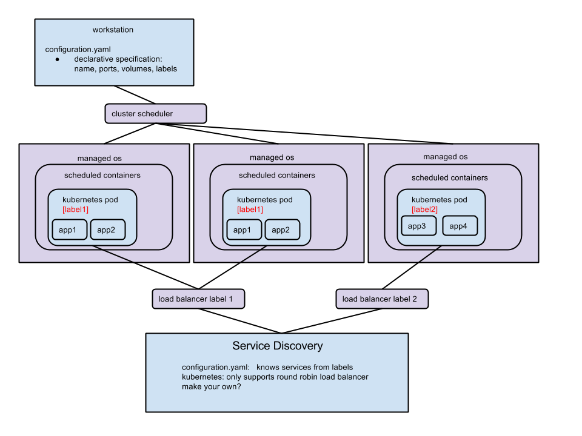

# What is this?

a collection of my research. may be outdated and/or inaccurate. no guarantees
 
## Cluster management stuff
__three types of scheduling architectures__ monolithic, two level, and shared state

mesos is a two level scheduler. advantages: can run many different frameworks on top and have resource sharing between them.
currently running a single framework (marathon) so not utilizing the scheduling aspect of mesos since offers only ever
go to one framework.

mesos disadvantage is resource hiding - offers are made to framework but they dont have global view of cluster. framework
latency when deciding what to schedule means resources are tied up. usually used for many small tasks that end quickly
not an ideal _service_ architecture. mesos assumes quick scheduling decisions, samll jobs, high resource churn. This 
is not the case for service jobs.

should have some sort of scheduling mechanism. This is perhaps something that each team (ex: CPAS) should implement

__batch__ and __service__ jobs are different. they should have different scheduler?

# Other
## Maestro
</img>

## Common Themes
Operate on cluster level instead of machine level. dont worry about which host which service

## 1. Mesos
</img>

## 2. Kubernetes
* __type of product: container cluster management__
	* declarative syntax for setting up containers
	* decouple applications from machines. dont care what machine application ends up on
	* sent job descriptions to master node, will spawn containers on work nodes
	* jobs described in "pods" (multiple containers per pod) for example web search frontend, datashard, data loader in one pod
	* labels -> tag pods with labels. (like services in maestro)
* __kubernetes elements__
	* pod. atomic unit for application. bunch of containers that work well together. could be 1 container, 5 containers. etc
	* replica controller : how many of your pods to keep up and running
	* like instances for your application in marathon
	* label: can make label queries (like service name for maestro, but can have many labels). like jquery selector
	* service:
	* labels for services -> services live behind load balancer (round robin)
* __service discovery: containers can access other labeled services__
	* labels act as selectors (label queries to pick a specific service) service containers live behind load balancer
	* __every host machine exposes service proxy__ not that useful for services where you must access specific containers ex: kafka
	* other containers can access service through the load balancer (round robin)
	* ex: getenv('REDISSLAVE_SERVICE_PORT'), getenv('REDISMASTER_SERVICE_PORT'), etc...
	* ex from here: https://github.com/GoogleCloudPlatform/kubernetes/blob/master/examples/guestbook/README.md
	* what about containers talking directly to other containers (not round robin load balancer)? change load balancer. make your own
	* 43:43   https://www.youtube.com/watch?v=tsk0pWf4ipw
	* </img>
* __benefits of using kubernetes?__
	* keep containers running
	* select out pods without having a sea of pods (dont have to worry about host machines)
	* benefits over marathon on mesos? idk
</img>
</img>

## 3. Helios
* job:  job name, a job version, the name of your Docker image, any environment variables you wish to pass to the running container, ports you wish to expose, and the command to run inside the container, if any.
* master: Helios masters are the servers that the Helios CLI and other tools talk to. They coordinate the deployment of your Docker containers onto Helios agents.
* agents: Helios agents, sometimes known as Helios hosts, are the machines on which the images you built eventually run. The masters tell agents to download jobs and run them.
* examples provided on their github page
	* basic deploy/undeploy
	* no service discovery example
	* not built in
* __benefits of using helios?__
	* dont worry about which hosts task run on?

## Other Technologies
* __skydock__
* __fleet__
	* Deploy a single container anywhere on the cluster
	* Deploy multiple copies of the same container
	* Ensure that containers are deployed together on the same machine
	* Forbid specific services from co-habitation
	* Maintain N containers of a service, re-deploying on failure
	* Deploy containers on machines matching specific metadata
* __kubernetes-mesos__
	* support for running other frameworks alongside kubernetes on mesos.
	* kubernetes executor -> no real improvements if only using kubernetes 
